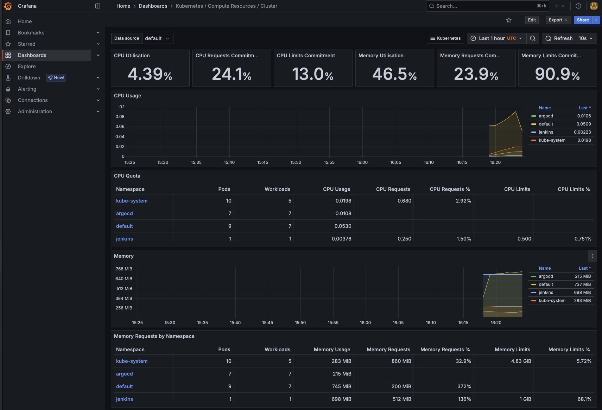

# Проєкт Terraform: AWS Інфраструктура для Django-проєкту

Цей проєкт створює інфраструктуру AWS з використанням Terraform + Helm + Jenkins.

Він охоплює:
- Побудову мережевої інфраструктури (VPC)
- Створення репозиторію ECR для зберігання Docker-образів
- Розгортання EKS-кластера з автоскейлінгом
- Деплой Jenkins-сервера в Kubernetes через Helm
- Деплой Argo CD в Kubernetes через Helm
- Створення Jenkins Job з підключенням до GitHub та збиранням Docker-образів
- Створення Jenkins Pipeline з підключенням до GitHub
- Push Docker-образів в ECR через Jenkins Pipeline
- Створення Argo CD Application з Helm-чартом Django-додатка
- Деплой Django-додатка в Kubernetes через Argo CD Application
- Створення бази даних RDS/Aurora через Terraform
- Підключення бази даних RDS/Aurora до EKS-кластера
- Моніторинг інфраструктури через Prometheus + Grafana

---

## Структура проєкту
```bash
/
│
├── main.tf                         # Головний файл для підключення модулів
├── backend.tf                      # Налаштування бекенду для стейтів (S3 + DynamoDB)
├── outputs.tf                      # Загальне виведення ресурсів
├── variables.tf                    # Змінні для модулей
├── terraform.tfvars                # Змінні для Terraform
├── Jenkinsfile                     # Файл конфігурації Jenkins
│
├── modules/                        # Каталог з усіма модулями
│   │
│   ├── s3-backend/                 # Модуль для S3 та DynamoDB
│   │   ├── s3.tf                   # Створення S3-бакета
│   │   ├── dynamodb.tf             # Створення DynamoDB
│   │   ├── variables.tf            # Змінні для S3
│   │   └── outputs.tf              # Виведення інформації про S3 та DynamoDB
│   │
│   ├── vpc/                        # Модуль для VPC
│   │   ├── vpc.tf                  # Створення VPC, підмереж, Internet Gateway
│   │   ├── routes.tf               # Налаштування маршрутизації
│   │   ├── variables.tf            # Змінні для VPC
│   │   └── outputs.tf              # Виведення інформації про VPC
│   │
│   ├── ecr/                        # Модуль для ECR
│   │   ├── ecr.tf                  # Створення ECR репозиторію
│   │   ├── variables.tf            # Змінні для ECR
│   │   └── outputs.tf              # Виведення URL репозиторію ECR
│   │
│   ├── eks/                        # Модуль для EKS
│   │   ├── aws_ebs_csi_driver.tf   # AWS EBS CSI Driver
│   │   ├── eks.tf                  # Створення EKS-кластера
│   │   ├── node.tf                 # Створення EKS-нод
│   │   ├── variables.tf            # Змінні для EKS
│   │   └── outputs.tf              # Виведення інформації про EKS
│   │
│   ├── jenkins/                    # Модуль для Jenkins
│   │   ├── jenkins-secret.tf       # Створення Jenkins-секретів
│   │   ├── jenkins.tf              # Створення Jenkins-кластера
│   │   ├── providers.tf            # Підключення провайдерів
│   │   ├── values.yaml             # Описання Jenkins контролера та JCasC
│   │   ├── variables.tf            # Змінні для Jenkins
│   │   └── outputs.tf              # Виведення інформації про Jenkins
│   │
│   └── rds/                        # Модуль для RDS та Aurora
│       ├── aurora.tf               # Створення Aurora
│       ├── rds.tf                  # Створення RDS
│       ├── shared.tf               # Об'єднанні налаштування для RDS та Aurora
│       ├── variables.tf            # Змінні для RDS та Aurora
│       └── outputs.tf              # Виведення інформації про RDS та Aurora
│
├── charts/                         # Каталог з Helm-каталогами    
│   └── django-app/                 # Helm-каталог для Django-проєкту
│       ├── Chart.yaml              # Метадані проєкту
│       ├── values.yaml             # Змінні для Django-проєкту
│       └── templates/              # Шаблони для Django-проєкту
│           ├── configmap.yaml      # Конфігмап
│           ├── deployment.yaml     # Депломент
│           ├── hpa.yaml            # Горизонтальне масштабування
│           └── service.yaml        # Сервіс
│
├── docker-django-app/              # Каталог з Docker-Django-app/
│
└── README.md                       # Документація проєкту
```


---
## Застосування Terraform

1. Ініціалізація Terraform:
   ```bash
   terraform init
   ```

2. Створення інфраструктури:
   ```bash
   terraform apply
   ```

3. В проєкті додано Jenkins та Argo CD через Helm, Terraform автоматично встановить ці сервіси й налаштує відповідні ресурси.

4. Видалення інфраструктури
   ```bash
   terraform destroy
   ```

## Перевірка запущеної інфраструктури для отримання URL-адрес Jenkins, Argo CD та Django-проєкту
```bash
kubectl get svc -A
```
### Результат


## Перевірка Jenkins Job

1. Відкрити веб-інтерфейс Jenkins:
   - Дізнатись зовнішній IP сервісу Jenkins:
     ```bash
     kubectl get svc -n jenkins
     ```
   - Перейдіть в браузері за отриманою адресою (наприклад: `http://<EXTERNAL-IP>`)

2. Увійти під обліковими даними адміністратора:
   - Ім’я користувача: `admin`
   - Пароль: `admin123`

3. Переконатись, що існує `seed-job`:
   - Якщо він є, натисніть **"Build Now"**, щоб згенерувати `goit-django-docker` pipeline.

4. Перевірити, що `goit-django-docker` зʼявився в списку і запустився автоматично або вручну.

### Результати роботи Jenkins


## Перевірка результату в Argo CD

1. Отримати URL доступу до Argo CD:
   ```bash
   kubectl get svc -n argocd
   ```
   - Знайти сервіс `argocd-server`, скопіюй його EXTERNAL-IP

2. Відкрити веб-інтерфейс Argo CD:
   ```
   https://<EXTERNAL-IP>
   ```

3. Увійти в Argo CD:
   - Ім’я користувача: `admin`
   - Пароль: отримати командою:
     ```bash
     kubectl get secret argocd-initial-admin-secret -n argocd -o jsonpath="{.data.password}" | base64 --decode
     ```

4. Знайти Application з назвою `example-app`.

5. Перевірити статус:
   - `Synced` — конфігурація з Git застосована
   - `Healthy` — ресурс працює коректно

6. Натиснути **Sync** (якщо не було автоматичної синхронізації), щоб оновити кластер після зміни Helm-чарта в Git.

### Результат роботи Argo CD


### Deploy Django-додатка в Kubernetes через Argo CD Application


---

## Приклад використання модуля RDS

```hcl
module "rds" {
  source = "./modules/rds"

  name                       = "django-app-db"
  use_aurora                 = true
  aurora_instance_count      = 2

  engine_cluster             = "aurora-postgresql"
  engine_version_cluster     = "15.3"
  parameter_group_family_aurora = "aurora-postgresql15"

  engine                     = "postgres"
  engine_version             = "17.2"
  parameter_group_family_rds = "postgres17"

  instance_class             = "db.t3.medium"
  allocated_storage          = 20
  db_name                    = "myapp"
  username                   = "postgres"
  password                   = "admin123AWS23"
  subnet_private_ids         = module.vpc.private_subnets
  subnet_public_ids          = module.vpc.public_subnets
  publicly_accessible        = false
  vpc_id                     = module.vpc.vpc_id
  multi_az                   = true
  backup_retention_period    = 7

  parameters = {
    max_connections              = "200"
    log_min_duration_statement   = "500"
  }

  tags = {
    Environment = "dev"
    Project     = "myapp"
  }
}
```

---

## Змінні модуля RDS

| Змінна                        | Тип             | Опис |
|------------------------------|------------------|------|
| `name`                       | `string`         | Ім’я ресурсу RDS / Aurora |
| `use_aurora`                 | `bool`           | Якщо `true`, створюється Aurora Cluster. Якщо `false` — стандартний RDS |
| `aurora_instance_count`      | `number`         | Кількість інстансів Aurora (мінімум 1 writer, опціонально репліки) |
| `aurora_replica_count`       | `number`         | Кількість реплік (reader) для Aurora |
| `engine`                     | `string`         | Двигун для RDS (наприклад `postgres`) |
| `engine_version`             | `string`         | Версія для RDS (наприклад `15.3`) |
| `engine_cluster`             | `string`         | Двигун для Aurora (наприклад `aurora-postgresql`) |
| `engine_version_cluster`     | `string`         | Версія Aurora engine |
| `parameter_group_family_rds`| `string`         | Параметри для RDS (наприклад `postgres15`) |
| `parameter_group_family_aurora`| `string`      | Параметри для Aurora (наприклад `aurora-postgresql15`) |
| `instance_class`             | `string`         | Клас інстансу RDS або Aurora (наприклад `db.t3.medium`) |
| `allocated_storage`          | `number`         | Розмір у GB (тільки для RDS) |
| `db_name`                    | `string`         | Назва бази даних |
| `username`                   | `string`         | Ім’я користувача бази |
| `password`                   | `string` (sensitive) | Пароль користувача |
| `vpc_id`                     | `string`         | ID VPC |
| `subnet_private_ids`         | `list(string)`   | ID приватних підмереж |
| `subnet_public_ids`          | `list(string)`   | ID публічних підмереж |
| `publicly_accessible`        | `bool`           | Доступ ззовні: true/false |
| `multi_az`                   | `bool`           | Розміщення інстансу в кількох AZ |
| `backup_retention_period`    | `string`         | Кількість днів зберігання резервних копій |
| `parameters`                 | `map(string)`    | Додаткові параметри PostgreSQL або Aurora |
| `tags`                       | `map(string)`    | Теґи для ресурсів |

---

## Змінення типу БД

- **Aurora → стандартний RDS:**

  ```hcl
  use_aurora = false
  ```

- **Змінити тип двигуна:**

  - Для **Aurora**:
    ```hcl
    engine_cluster = "aurora-postgresql"
    engine_version_cluster = "15.3"
    parameter_group_family_aurora = "aurora-postgresql15"
    ```

  - Для **RDS PostgreSQL**:
    ```hcl
    engine = "postgres"
    engine_version = "17.2"
    parameter_group_family_rds = "postgres17"
    ```

- **Змінити клас інстансу:**

  ```hcl
  instance_class = "db.t3.large"
  ```

- **Налаштувати публічність:**

  ```hcl
  publicly_accessible = true
  ```

### Результат створення БД


### Результат створення БД (Aurora)


---

## Моніторинг ресурсів
Встановлення моніторинг ресурсів за допомогою Helm
```bash
helm repo add prometheus-community https://prometheus-community.github.io/helm-charts
helm repo update
helm install monitoring prometheus-community/kube-prometheus-stack
```

Перевірка роботи моніторингу:
```bash
kubectl --namespace default get pods -l "release=monitoring"
```

Отримати пароль для 'admin' користувача (default password: **prom-operator**):
```bash
kubectl --namespace default get secrets monitoring-grafana -o jsonpath="{.data.admin-password}" | base64 -d ; echo
```

Отримати доступ до Grafana за допомогою port-forward:
```bash
export POD_NAME=$(kubectl --namespace default get pod -l "app.kubernetes.io/name=grafana,app.kubernetes.io/instance=monitoring" -oname)
kubectl --namespace default port-forward $POD_NAME 3000
```

### Приклади моніторингу ресурсів (Prometheus + Grafana)
#### 1. Networking Workload


#### 2. Compute Resources Cluster


#### 3. Compute Resources Namespace Pods


#### 4. Kubelet


#### 5. Networking Namespace Pods


---

## Використання ручних кроків синхронізації

### 1. Ініціалізація проєкту

```bash
terraform init
```
❗️Перед цим слід вручну створити S3-бакет і DynamoDB-таблицю, які вказані у backend.tf

### 2. Перегляд плану
```bash
terraform plan
```

### 3. Створення інфраструктури
```bash
terraform apply
```

### 4. Видалення інфраструктури
```bash
terraform destroy
```

### 5. Оновлення kubeconfig для підключення до EKS-кластера
```bash
aws eks update-kubeconfig --region us-east-1 --name eks-cluster-demo
```

### 6. Перевірити з'єднання до EKS-кластера
```bash
kubectl get nodes
```
або

```bash
kubectl cluster-info
```

### 7. Отримати ECR URL з Terraform
```bash
export ECR_URL=$(terraform output -raw ecr_repository_url)
```

### 8. Зібрати Docker-образ
```bash
cd ../doker-django-app/django
docker build -t l7-dj-app .
```

### 9. Тегувати образ
```bash
docker tag l7-dj-app:latest $ECR_URL
```

### 10. Login в ECR
```bash
aws ecr get-login-password --region us-east-1 | docker login --username AWS --password-stdin $ECR_URL
```

### 11. Пушити образ в ECR
```bash
docker push $ECR_URL
```

### 12.  Перейти в корінь Helm
```bash
cd charts
```

### 13. (опціонально) перевірити шаблони:
```bash
helm template django-app ./django-app
```

### 14. Додати у кластер:
```bash
helm install django-app ./django-app
```

### 15. Перевірити статус:
```bash
helm status django-app
```

### 16. Перевірити EKS pods
```bash
kubectl get pods
```
або

```bash
kubectl get deployment django-app

```

### 17. Перевірити k8s сервіси та їх URL
```bash
kubectl get svc -A
```

## Огляд модулів

### s3-backend
    Створює S3-бакет з увімкненим версіюванням
    Створює DynamoDB-таблицю з атрибутом LockID для блокування стейт-файлу
    Виводить ARN та URL бакета, назву таблиці
### vpc
    Створює VPC з CIDR-блоком
    3 публічні та 3 приватні підмережі
    Internet Gateway для публічних підмереж
    NAT Gateway (можна додати)
    Route Tables та асоціації
### ecr
    Створює ECR репозиторій
    Автоматичне сканування образів при пуші (scan_on_push)
    Виводить URL репозиторію
### eks
    Створює кластер EKS з доступом до API
    Створює IAM-ролі для кластеру та нодів
    Додає Node Group зі змінним розміром (autoscaling)
    Параметри: instance_type, desired_size, max_size, min_size
    Виводить ім’я та endpoint кластера, IAM-роль вузлів
### jenkins
    Створює Jenkins-сервер
    Виводить URL Jenkins-сервера
    Створює Jenkins Job з підключенням до GitHub
    Збирає Docker-образ з директорії docker-django-app
    Пушить образ в ECR
    Оновлює GitHub-репозиторій з версією білду
### argo_cd
    Створює Application з Helm-чартом django-app
    Робить Deployment django-app у кластері 

## Параметри, які можна змінювати

    Ім’я S3-бакета для state-файлів (bucket_name)
    Ім’я DynamoDB-таблиці (table_name)
    CIDR блок VPC та CIDR підмереж
    Ім’я ECR репозиторію (ecr_name)


## Helm-чарт django-app

### configmap.yaml
    Містить ключі з .env файлу (наприклад POSTGRES_HOST, POSTGRES_PORT тощо). Вони додаються у контейнер через envFrom.

### deployment.yaml
    Створює Pod з образом Django (з ECR)
    Підключає змінні середовища через ConfigMap
    Працює на port 8000 (вказаний у Django)
    Параметри образу конфігуруються у values.yaml

### service.yaml
    Тип: LoadBalancer
    Проксіює порт 80 до 8000 всередині контейнера
    Дозволяє зовнішній доступ до Django через DNS

### hpa.yaml
    Масштабує кількість pod’ів у межах 2–6
    Базується на CPU utilization > 70%
